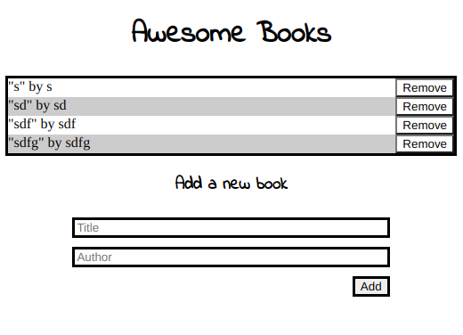

# AwesomeBooks

> Simple Javascript exercise about a basic Book Storage.

The purpose of this project is to practice basic Javascript skills using Objects and Classes to get a simple book list in LocalStorage.

## Built With

- Javascript
- Html

## Authors

👤 **Eduardo Sancho**

- GitHub: [@eduardosancho](https://github.com/eduardosancho)
- Twitter: [@sanchitobless](https://twitter.com/sanchitobless)
- LinkedIn: [LinkedIn](https://www.linkedin.com/in/eduardo-sancho-043641181/)

👤 **Giancarlo Dumani**

- GitHub: [@gdumani](https://github.com/gdumani)
- Twitter: [@gdumani1](https://twitter.com/gdumani1)
- LinkedIn: [ Giancarlo-Dumani](https://www.linkedin.com/in/gdumani/?originalSubdomain=cr)
## 🤝 Contributing

Contributions, issues, and feature requests are welcome!

Feel free to check the [issues page](https://github.com/ivaan1992/AwesomeBooks/issues).

## Show your support

Give a ⭐️ if you like this project!

## Acknowledgments

- Hat tip to anyone whose code was used
- Inspiration
- etc

## 📝 License

This project is [MIT](./MIT.md) licensed.
